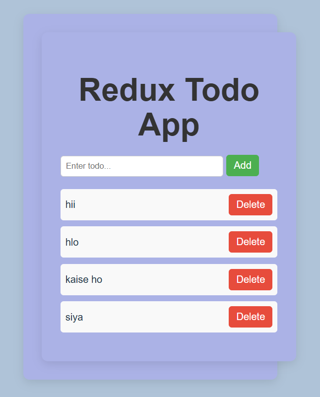

# Redux Todo App

A modern, lightweight Todo application built with **React**, **Redux Toolkit**, and **Vite**. Manage your daily tasks efficiently with a clean and intuitive interface.



---

## 🚀 Features

- **Add Todos** – Quickly add new tasks to your list
- **Delete Todos** – Remove completed or unwanted tasks
- **Toggle Completion** – Mark tasks as complete/incomplete with a single click
- **Persistent State** – Redux Toolkit manages global state efficiently
- **Fast Performance** – Powered by Vite for lightning-fast development and builds

---

## 🛠️ Tech Stack

| Technology | Description |
|------------|-------------|
| **React** | UI library for building the interface |
| **Redux Toolkit** | State management solution |
| **Vite** | Next-generation frontend tooling |
| **JavaScript** | Programming language |

---

## 📦 Installation

1. **Clone the repository**
   ```bash
   git clone <repository-url>
   cd Redux
   ```

2. **Install dependencies**
   ```bash
   npm install
   ```

3. **Start the development server**
   ```bash
   npm run dev
   ```

4. **Build for production**
   ```bash
   npm run build
   ```

---

## 📖 Usage

1. Enter a task in the input field
2. Click **Add** to add the todo to your list
3. Click on a todo item to toggle its completion status
4. Click **Delete** to remove a todo from the list

---

## 📁 Project Structure

```
Redux/
├── src/
│   ├── app/
│   │   └── store.js          # Redux store configuration
│   ├── components/
│   │   └── Todo.jsx          # Todo component
│   ├── feature/
│   │   └── todo/
│   │       └── todoSlice.js  # Redux slice for todos
│   ├── App.jsx               # Main App component
│   ├── main.jsx              # Entry point
│   └── style.css             # Global styles
├── images/
│   └── screenshot.png        # App screenshot
├── index.html
├── package.json
└── vite.config.js
```

## 📄 License

This project is open-source and available under the MIT License.

---


